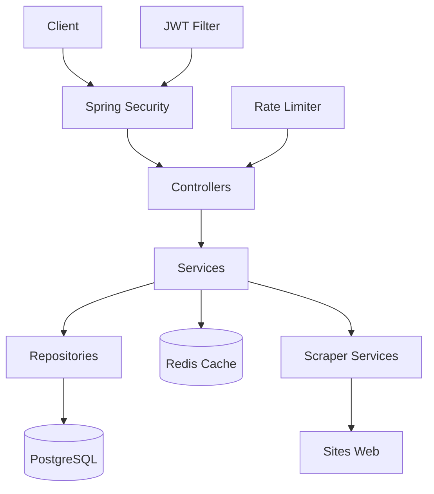

# 🔍 Job Scraper 237

Une API REST moderne pour centraliser les offres d'emploi au Cameroun en scrapant automatiquement différents sites de recrutement.

## 📋 Table des matières

- [Description](#description)
- [Fonctionnalités](#fonctionnalités)
- [Technologies utilisées](#technologies-utilisées)
- [Prérequis](#prérequis)
- [Installation](#installation)
- [Configuration](#configuration)
- [Utilisation](#utilisation)
- [API Endpoints](#api-endpoints)
- [Architecture](#architecture)
- [Contribution](#contribution)
- [Licence](#licence)

## 🎯 Description

Job Scraper 237 est une application Spring Boot qui automatise la collecte d'offres d'emploi depuis différents sites web camerounais. L'application fournit une API REST sécurisée pour rechercher, consulter et gérer les offres d'emploi centralisées.

### Problème résolu
Les offres d'emploi au Cameroun sont dispersées sur de nombreux sites web, rendant difficile la recherche d'opportunités. Cette application centralise ces informations en un seul point d'accès.

## ✨ Fonctionnalités

### 🔐 Authentification et Sécurité
- Inscription et connexion sécurisées avec JWT
- Authentification OAuth2 (Google)
- Rate limiting pour prévenir les abus
- Système de verrouillage de compte après échecs de connexion
- Tokens de rafraîchissement avec gestion des cookies HttpOnly

### 📊 Gestion des offres d'emploi
- Scraping automatique des sites d'emploi
- Recherche avancée avec filtres (localisation, mots-clés, entreprise)
- Pagination des résultats
- Déduplication automatique des offres
- Gestion de la persistence avec base de données

### 🛡️ Fonctionnalités avancées
- Cache Redis pour optimiser les performances
- Résilience avec Resilience4j (rate limiting, retry)
- Monitoring avec Spring Boot Actuator
- Documentation API avec OpenAPI 3 (Swagger)
- Tests automatisés

## 🛠️ Technologies utilisées

### Backend
- **Java 21** - Langage de programmation
- **Spring Boot 3.5.4** - Framework principal
- **Spring Security** - Sécurité et authentification
- **Spring Data JPA** - Couche de persistance
- **Spring Boot Actuator** - Monitoring

### Base de données
- **PostgreSQL** - Base de données principale (production)
- **H2** - Base de données en mémoire (développement)
- **Redis** - Cache et sessions

### Sécurité et Resilience
- **JWT** - Tokens d'authentification
- **OAuth2** - Authentification sociale
- **Resilience4j** - Rate limiting et circuit breaker

### Scraping et Documentation
- **JSoup** - Parsing HTML pour le scraping
- **OpenAPI 3** - Documentation API
- **Maven** - Gestionnaire de dépendances

### DevOps
- **Docker & Docker Compose** - Containerisation
- **Lombok** - Réduction du code boilerplate

## 📋 Prérequis

- **Java 21** ou supérieur
- **Maven 3.8+**
- **Docker & Docker Compose** (optionnel)
- **PostgreSQL 16+** (si sans Docker)
- **Redis 7+** (si sans Docker)

## 🚀 Installation

### 1. Cloner le repository
```bash
git clone https://github.com/BassilekinJean/Job-scraper-237.git
cd Job-scraper-237/jobscraper
```

### 2. Installation avec Docker (Recommandé)
```bash
# Démarrer tous les services
docker-compose up -d

# L'application sera disponible sur http://localhost:8081
```

### 3. Installation manuelle

#### Configuration de la base de données
```bash
# Installer PostgreSQL et Redis
sudo apt-get install postgresql redis-server

# Créer la base de données
sudo -u postgres createdb gestio_pro
```

#### Configurer les variables d'environnement
```bash
export JWT_SK_SCRAPPER="votre-secret-jwt-très-sécurisé"
export GOOGLE_SIGNIN_ID_GESTIO="votre-google-client-id"
export GOOGLE_SIGNIN_SK_GESTIO="votre-google-client-secret"
export EMAIL_GESTIO="votre-email@gmail.com"
export EMAIL_SK_GESTIO="votre-mot-de-passe-email"
```

#### Compiler et démarrer
```bash
# Compiler le projet
./mvnw clean compile

# Démarrer l'application
./mvnw spring-boot:run
```

## ⚙️ Configuration

### Variables d'environnement

| Variable | Description | Requis |
|----------|-------------|---------|
| `JWT_SK_SCRAPPER` | Clé secrète pour JWT | ✅ |
| `GOOGLE_SIGNIN_ID_GESTIO` | Client ID Google OAuth2 | ❌ |
| `GOOGLE_SIGNIN_SK_GESTIO` | Client Secret Google OAuth2 | ❌ |
| `EMAIL_GESTIO` | Email pour notifications | ❌ |
| `EMAIL_SK_GESTIO` | Mot de passe email | ❌ |

### Configuration des profiles

```yaml
# Profile de développement (application-dev.properties)
spring.profiles.active=dev
spring.datasource.url=jdbc:h2:mem:testdb

# Profile de production (application-prod.properties)
spring.profiles.active=prod
spring.datasource.url=jdbc:postgresql://localhost:5432/gestio_pro
```

## 📖 Utilisation

### Démarrage rapide

1. **Démarrer l'application**
```bash
docker-compose up -d
```

2. **Créer un compte administrateur**
```bash
curl -X POST http://localhost:8081/api/v1/auth/register \
  -H "Content-Type: application/json" \
  -d '{
    "userEmail": "admin@example.com",
    "userPassword": "MotDePasse123!",
    "confirmPassword": "MotDePasse123!"
      }'
```

3. **Se connecter**
```bash
curl -X POST http://localhost:8081/api/v1/auth/login \
  -H "Content-Type: application/json" \
  -d '{
    "username": "admin@example.com",
    "password": "MotDePasse123!"
  }'
```

4. **Lancer le scraping**
```bash
curl -X POST http://localhost:8081/api/v1/jobs/scrape \
  -H "Authorization: Bearer YOUR_JWT_TOKEN"
```

### Interface de développement

- **API Documentation**: http://localhost:8081/api/v1/swagger-ui.html
- **Base de données H2**: http://localhost:8081/api/v1/h2-console
- **Adminer** (avec Docker): http://localhost:8085

## 🔌 API Endpoints

### Authentification
```
POST /api/v1/auth/register     # Inscription
POST /api/v1/auth/login        # Connexion
POST /api/v1/auth/logout       # Déconnexion
POST /api/v1/auth/refresh      # Rafraîchir le token
```

### Gestion des emplois
```
GET  /api/v1/jobs              # Lister les offres (public)
GET  /api/v1/jobs/{id}         # Détails d'une offre (admin)
POST /api/v1/jobs/create       # Créer une offre (admin)
POST /api/v1/jobs/scrape       # Lancer le scraping (admin)
```

### Exemples d'utilisation

#### Recherche d'offres avec filtres
```bash
curl "http://localhost:8081/api/v1/jobs?page=0&size=10&location=Yaoundé&keyword=développeur"
```

#### Réponse typique
```json
{
  "content": [
    {
      "id": 1,
      "title": "Développeur Java Senior",
      "company": "TechCorp Cameroon",
      "location": "Yaoundé",
      "description": "Nous recherchons un développeur Java expérimenté...",
      "postedAt": "2025-08-19T10:30:00",
      "source": "INFO_CONCOURS",
      "originalUrl": "https://example.com/job/123"
    }
  ],
  "pageable": {
    "pageNumber": 0,
    "pageSize": 10
  },
  "totalElements": 45,
  "totalPages": 5
}
```

## 🏗️ Architecture

### Structure du projet
```
src/main/java/com/cameroun/jobscraper/
├── JobscraperApplication.java          # Point d'entrée
├── configuration/                      # Configuration Spring
│   ├── RedisTemplateConfig.java
│   ├── Resilience4jConfig.java
│   └── SecurityConfig.java
├── controller/                         # Contrôleurs REST
│   ├── AuthentificationController.java
│   ├── JobController.java
│   └── UserController.java
├── Dto/                               # Objets de transfert
│   ├── JobDto.java
│   ├── PagedResponse.java
│   └── UserRegistrationDto.java
├── enums/                             # Énumérations
├── model/                             # Entités JPA
│   ├── JobOffer.java
│   └── Utilisateur.java
├── repository/                        # Repositories JPA
├── scrapper/                          # Services de scraping
│   └── JobInfoConcoursScraperService.java
├── security/                          # Sécurité JWT
└── service/                          # Logique métier
```

### Architecture technique



## 🤝 Contribution

1. **Fork** le repository
2. **Créer** une branche pour votre fonctionnalité
```bash
git checkout -b feature/nouvelle-fonctionnalite
```
3. **Commiter** vos changements
```bash
git commit -m "Ajout: nouvelle fonctionnalité"
```
4. **Pousser** vers la branche
```bash
git push origin feature/nouvelle-fonctionnalite
```
5. **Créer** une Pull Request

### Standards de code
- Suivre les conventions Java/Spring Boot
- Documenter les nouvelles API avec OpenAPI
- Ajouter des tests unitaires
- Respecter les principes SOLID

## 📝 TODO

- [ ] Ajouter plus de sites de scraping
- [ ] Système de notifications par email
- [ ] Interface web frontend
- [ ] API de recherche full-text avec Elasticsearch
- [ ] Système de favoris utilisateur
- [ ] Export PDF des offres
- [ ] Statistiques et analytics

## 📄 Licence

Ce projet est sous licence MIT - voir le fichier [LICENSE](LICENSE) pour plus de détails.

## 👨‍💻 Auteur

**BassilekinJean** - [GitHub](https://github.com/BassilekinJean)

---

⭐ N'hésitez pas à donner une étoile si ce projet vous aide !

## 📞 Support

Pour toute question ou problème :
- Ouvrez une [issue](https://github.com/BassilekinJean/Job-scraper-237/issues)
- Email: bassilekinjean@outlook.com

---

*Fait avec ❤️ pour la communauté tech camerounaise*
